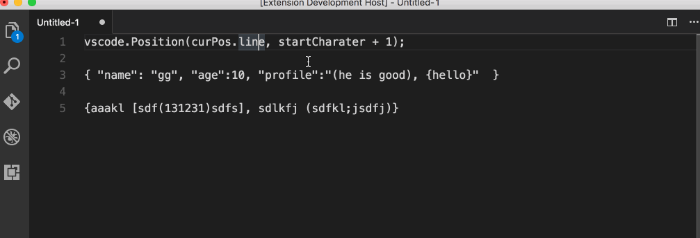

# Functionality

This is small tool for selecting content in brackets

# Configuration

- Keyboard Setting:
{ "key": "cmd+ctrl+m", "command": "extension.selectTextInBracket"}

# Usage

1. Put the cursor in the center of the brackets
2. Use hot keys

Market Place: https://marketplace.visualstudio.com/items?itemName=guosong.bracketselection